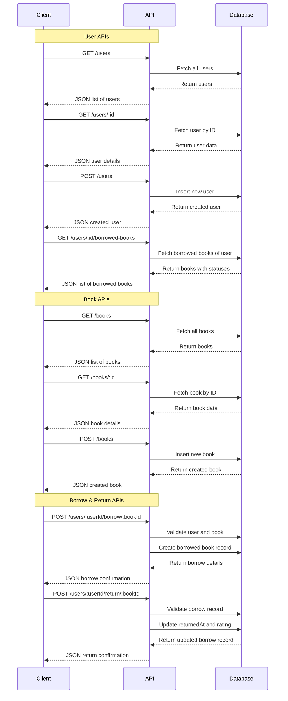

```mermaid
sequenceDiagram
    participant Client
    participant API
    participant Database

    Note over Client,API: User APIs

    Client->>API: GET /users
    API->>Database: Fetch all users
    Database-->>API: Return users
    API-->>Client: JSON list of users

    Client->>API: GET /users/:id
    API->>Database: Fetch user by ID
    Database-->>API: Return user data
    API-->>Client: JSON user details

    Client->>API: POST /users
    API->>Database: Insert new user
    Database-->>API: Return created user
    API-->>Client: JSON created user

    Client->>API: GET /users/:id/borrowed-books
    API->>Database: Fetch borrowed books of user
    Database-->>API: Return books with statuses
    API-->>Client: JSON list of borrowed books

    Note over Client,API: Book APIs

    Client->>API: GET /books
    API->>Database: Fetch all books
    Database-->>API: Return books
    API-->>Client: JSON list of books

    Client->>API: GET /books/:id
    API->>Database: Fetch book by ID
    Database-->>API: Return book data
    API-->>Client: JSON book details

    Client->>API: POST /books
    API->>Database: Insert new book
    Database-->>API: Return created book
    API-->>Client: JSON created book

    Note Over Client,API: Borrow & Return APIs

    Client->>API: POST /users/:userId/borrow/:bookId
    API->>Database: Validate user and book
    API->>Database: Create borrowed book record
    Database-->>API: Return borrow details
    API-->>Client: JSON borrow confirmation

    Client->>API: POST /users/:userId/return/:bookId
    API->>Database: Validate borrow record
    API->>Database: Update returnedAt and rating
    Database-->>API: Return updated borrow record
    API-->>Client: JSON return confirmation
```