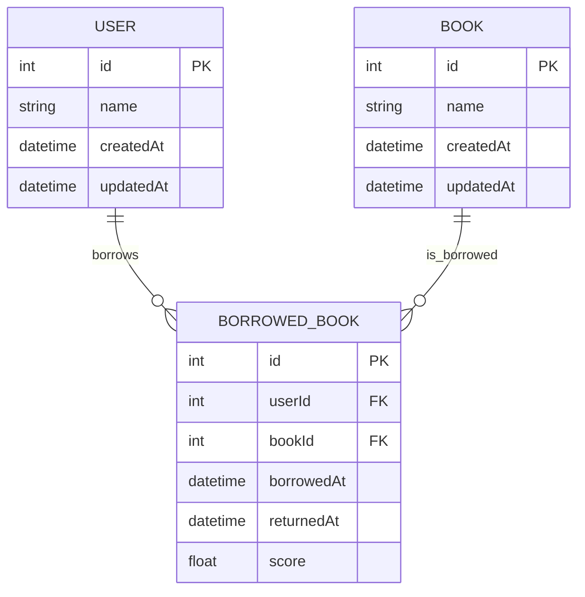

```mermaid
erDiagram
    USER ||--o{ BORROWED_BOOK : borrows
    BOOK ||--o{ BORROWED_BOOK : is_borrowed
    
    USER {
        int id PK
        string name
        datetime createdAt
        datetime updatedAt
    }
    
    BOOK {
        int id PK
        string name
        datetime createdAt
        datetime updatedAt
    }
    
    BORROWED_BOOK {
        int id PK
        int userId FK
        int bookId FK
        datetime borrowedAt
        datetime returnedAt
        float score
    }
```